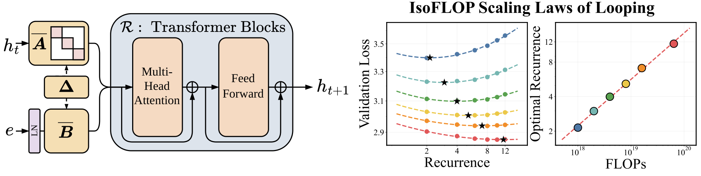

<h1 align="center" style="fontsize:50em"><b>Parcae</b></h1>


> **Parcae: Scaling Laws For Stable Looped Language Models**\
> Hayden Prairie, Zachary Novack, Taylor Berg-Kirkpatrick, Daniel Y. Fu\
> Paper: https://arxiv.org/abs/2604.12946


# About

Parcae is a new looped architecture, which utilizes a handful of techniques to drastically stabilize training. Parcae enables stable, hassle-free training of looped models, which we use to derive the first scaling laws for looping, finding that compute-optimal training scales looping and data in tandem.

# Installation

Just wanna use models off the shelf? We make things easy with a PyPI package to access models. Install the package with the following:
```bash
pip install parcae-lm
```
If you are training models then please clone the github repository 
```bash
git clone https://github.com/SandyResearch/parcae.git
cd parcae
```
and then follow the following:

### Docker (recommended)

Our launch scripts handle everything automatically. Set `PROJECT_DIR` and `DOCKER_IMAGE` at the top of `launch_job.slurm` or `launch_interactive.sh`, then:

```bash
# Interactive development shell
bash launch_interactive.sh

# Submit a training job
CONFIG=launch_configs/parcae-small-140m.yaml sbatch launch_job.slurm
```

The Docker image is hosted publicly at `ghcr.io/sandyresearch/parcae` and will be pulled automatically.

### Local

Requires Python 3.11+ and PyTorch 2.4+. Install PyTorch first following [pytorch.org](https://pytorch.org/get-started/locally/), then:

```bash
pip install -e .
```

# Usage

## Models

We provide three ways to instantiate models: load pretrained weights with `from_pretrained`, build from a built-in config with `create_model`, or customize a config before building with `create_config`.

```python
import parcae_lm

# Load a pretrained model from HuggingFace
model = parcae_lm.from_pretrained("SandyResearch/parcae-140m")

# Create a model from a built-in config
model = parcae_lm.create_model("parcae-small-140m")

# Or get the config, customize it, then build
config = parcae_lm.create_config("parcae-small-140m")
config.mean_recurrence = 16
model = config.construct_model()
```

## Training

### Downloading Data

```bash
python scripts/download_data.py fineweb-100bt   # FineWeb-Edu 100B tokens
python scripts/download_data.py fineweb-350bt   # FineWeb-Edu 350B tokens
python scripts/download_data.py huginn          # Huginn dataset
```

### Training a Tokenizer

Train a GPT-4 style BPE tokenizer on your data:

```bash
python scripts/tok_train.py --data-dir fineweb --output-dir tokenizer/ --vocab-size 32768
```

Evaluate compression ratios against GPT-2 and GPT-4 tokenizers:

```bash
python scripts/tok_eval.py --tokenizer tokenizer/parcae_tokenizer --data-dir fineweb
```

### Launching Training

Training is configured via YAML files in `launch_configs/`. Available configs:

| Config | Architecture | Parameters |
|--------|-------------|------------|
| `parcae-small-140m.yaml` | Parcae | 140M |
| `parcae-medium-370m.yaml` | Parcae | 370M |
| `parcae-large-770m.yaml` | Parcae | 770M |
| `parcae-xlarge-1_3b.yaml` | Parcae | 1.3B |
| `gpt-small-140m.yaml` | GPT | 140M |
| `gpt-medium-370m.yaml` | GPT | 370M |
| `gpt-large-770m.yaml` | GPT | 770M |
| `gpt-xlarge-1_3b.yaml` | GPT | 1.3B |

**Single node:**

```bash
bash runs/run_training.sh launch_configs/parcae-small-140m.yaml parcae-small 8
```

**Multi-node (Slurm):**

```bash
CONFIG=launch_configs/parcae-large-770m.yaml sbatch launch_job.slurm
```

## Eval

Evaluate models using `scripts/eval.py`. Supports loading from HuggingFace or local checkpoints.

```bash
# Evaluate a pretrained model from HuggingFace
python scripts/eval.py --hf_repo SandyResearch/parcae-140m --eval_tasks core

# Evaluate a local checkpoint
bash runs/run_eval.sh outputs/parcae-small-140m eval_configs/eval-core.yaml 8

# Evaluate validation loss
python scripts/eval.py --hf_repo SandyResearch/parcae-140m --eval_tasks bpb \
    --tasks.bpb.val_data_dir /path/to/val/data
```

Available eval configs in `eval_configs/`:
- `eval-core.yaml` — Core benchmark suite
- `eval-core-extended.yaml` — Extended core benchmarks
- `eval-val-loss.yaml` — Validation loss / bits-per-byte
- `eval-lambada.yaml` — LAMBADA evaluation

# Pretrained Models

Pretrained models are uploaded to [Hugging Face](https://huggingface.co/SandyResearch): `parcae-140m`, `parcae-370m`, `parcae-770m`, `parcae-1.3b`, trained on the [FineWeb-Edu](https://huggingface.co/datasets/HuggingFaceFW/fineweb-edu) dataset. Models will be auto-downloaded when using `from_pretrained`.

These models dimensions are:

| Model | Parameters | Prelude | Core | Coda | Model dim. | Recurrence |
|-------|-----------|---------|------|------|-----------|------------|
| Parcae-140M | 140M | 2 | 2 | 2 | 768 | 8 |
| Parcae-370M | 370M | 4 | 4 | 4 | 1024 | 8 |
| Parcae-770M | 770M | 6 | 6 | 6 | 1280 | 8 |
| Parcae-1.3B | 1.3B | 8 | 8 | 8 | 1536 | 8 |

Note: these are base models without any form of downstream modification (instruction tuning, etc.). 


# Replicating Scaling Laws

The sweep scripts in `runs/` reproduce the scaling law experiments from the paper. See `runs/sweep_recurrence.sh` for recurrence scaling and `runs/sweep_flops.sh` for compute-optimal scaling.

# Citations

```bibtex
@misc{prairie2026parcaescalinglawsstable,
      title={Parcae: Scaling Laws For Stable Looped Language Models}, 
      author={Hayden Prairie and Zachary Novack and Taylor Berg-Kirkpatrick and Daniel Y. Fu},
      year={2026},
      eprint={2604.12946},
      archivePrefix={arXiv},
      primaryClass={cs.LG},
      url={https://arxiv.org/abs/2604.12946}, 
}
```

# References

This code-base was built on `karpathy/nanochat`, `seal-rg/recurrent-pretraining`, and `Lightning-AI/litgpt`. While most code has been thoroughly adapted, we greatly appreciate the work that went into developing each of these training libraries.
